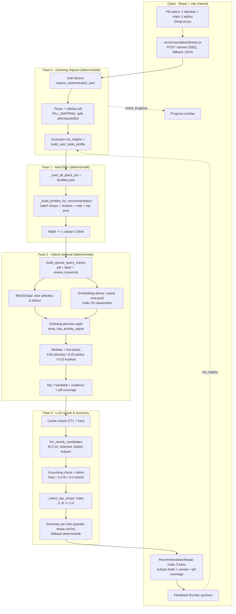
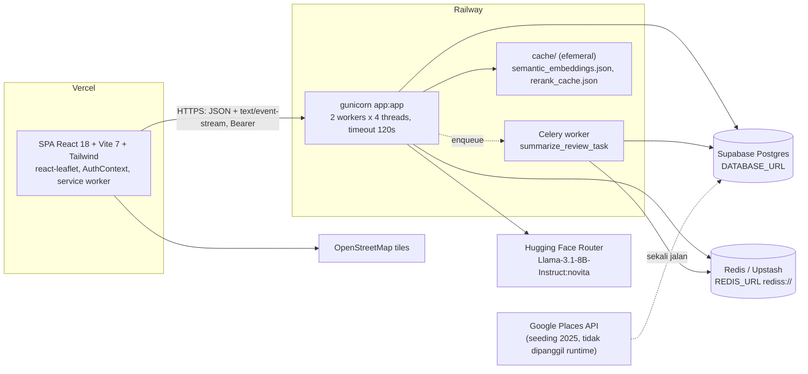

# Arsitektur CoFind — Versi Terkini

Dokumen ini menggantikan diagram arsitektur lama (alur `PILL SELECT -> PARSE JSON -> SCORING SHOP -> FILTER+SORT TOP 10 -> LLM PREFERENCE KEYWORDS -> RE-RANK TOP 10 -> BUILD EVIDENCE & SUMMARIZE`) yang sudah tidak sesuai dengan kode.

Berkas diagram yang bisa diedit: [`arsitektur-cofind.drawio`](./arsitektur-cofind.drawio) — 3 halaman:

| Halaman | Isi |
| --- | --- |
| 1. Pipeline Rekomendasi | Alur request rekomendasi ujung ke ujung (Fase 0–3), plus lapis data/model/cache |
| 2. Arsitektur Sistem & Deployment | Topologi Vercel / Railway / Supabase / Redis / Hugging Face Router |
| 3. Peta Perubahan vs Diagram Lama | Setiap kotak diagram lama dipetakan ke kondisi kode sekarang |

## Cara membuka & mengedit di draw.io

Berkas disimpan sebagai XML `mxfile` tanpa kompresi, sehingga bisa diedit langsung maupun di-review lewat diff Git.

1. **Web**: buka [app.diagrams.net](https://app.diagrams.net) → `File > Open from > Device` → pilih `docs/arsitektur-cofind.drawio`.
2. **VS Code**: pasang ekstensi *Draw.io Integration* (`hediet.vscode-drawio`), lalu klik berkasnya di explorer.
3. **Desktop**: draw.io Desktop membuka berkas `.drawio` secara langsung.
4. **GitHub**: tempel URL berkas ke [app.diagrams.net](https://app.diagrams.net) lewat `File > Open from > GitHub` agar hasil edit bisa langsung di-commit.

Tiap halaman ada di tab bawah jendela draw.io. Warna mengikuti legenda di halaman 1: hijau = tahap deterministik, oranye = tahap yang memakai LLM, biru = sisi klien, merah = penyimpanan data/model, kuning = cache, abu-abu garis putus = nonaktif/legacy.

## Ringkasan perubahan utama

1. **Input dua lapis, bukan teks bebas.** Satu pill konteks aktivitas (maksimum 1) digabung dengan maksimum 3 pill atribut fasilitas.
2. **Scoring manual diganti hybrid retrieval.** BM25 (`rank_bm25`) + embedding dense multilingual + sinyal kualitas, dengan gerbang aktivitas wajib.
3. **Top 10 menjadi top 7, keluaran akhir 0–3.** Slot kosong dibiarkan kosong kalau bukti ulasannya tidak ada.
4. **Ekspansi kata kunci oleh LLM dihapus.** Kedekatan makna ditangani embedding, bukan sinonim hasil LLM.
5. **LLM hanya dipakai di dua titik**: rerank kandidat dan penyusunan ringkasan per toko (plus perbaikan JSON bila keluaran model rusak).
6. **Tahapan baru**: autentikasi wajib, feedback loop (`not_helpful` sebagai exclusion), personalisasi selera user, streaming progres lewat SSE, cache berlapis, grounding check, dan telemetri per tahap.
7. **Google Places API tidak lagi ada di jalur runtime.** Data toko sudah berada di Supabase Postgres (hasil seeding 2025, sekarang dikelola panel admin); peta memakai OpenStreetMap via Leaflet.

## Pipeline rekomendasi (ringkas)

Sumber: `app.py::_recommendation_pipeline_events`, `hybrid_retrieval.py`, `llm_recommender.py`.

## Topologi sistem

## Konstanta & variabel lingkungan yang menentukan bentuk pipeline

| Variabel | Default | Peran |
| --- | --- | --- |
| `COFIND_RETRIEVAL_TOP_K` | 7 | Ukuran pool kandidat keluaran Fase 2 |
| `COFIND_LLM_RERANK_CANDIDATES` | 7 | Kandidat yang dikirim ke prompt rerank |
| `MAX_REC` (konstanta di `app.py`) | 3 | Batas jumlah rekomendasi akhir |
| `COFIND_LLM_MIN_FIT` | 5.0 | Ambang `fit_score` agar toko boleh tampil |
| `COFIND_LLM_RERANK_WEIGHT` | 0.6 | Porsi skor LLM saat blend dengan skor hybrid |
| `COFIND_DENSE_MAX_REVIEWS` | 20 | Ulasan per toko yang di-encode untuk skor dense |
| `COFIND_PROMPT_REVIEW_SCAN` / `_LIMIT` | 60 / 8 | Ulasan yang dipindai vs disimpan sebagai evidence |
| `COFIND_EMBEDDING_MODEL` | `paraphrase-multilingual-MiniLM-L12-v2` | Model embedding (in-process, bukan API) |
| `HF_MODEL` | `meta-llama/Llama-3.1-8B-Instruct:novita` | Model LLM untuk rerank & ringkasan |
| `COFIND_VECTOR_CACHE_TTL_DAYS` | 30 | Umur cache embedding |
| `RERANK_CACHE_EXPIRY_DAYS` (`cache_paths.py`) | 7 | Umur cache hasil rerank |
| `COFIND_DEV_LLM_STRICT` | false | Bila true, request gagal (503) saat LLM tidak tersedia |

Bobot fusi Fase 2 **tidak** dibaca dari `COFIND_HYBRID_*_WEIGHT`; `retrieve_top_k()` memakai 0.65 aktivitas / 0.25 atribut / 0.10 kualitas, dengan komposisi aktivitas 0.40 BM25 + 0.35 dense + 0.25 leksikal.

## Komponen yang ada di kode tapi nonaktif di jalur rekomendasi

- `llm_clause_sentiment.py` — `COFIND_LLM_CLAUSE_SENTIMENT` default `false` dan tidak dipanggil dari pipeline (hanya flush cache dan endpoint status).
- `semantic_match.match_reviews` (gerbang makna per klausa) dan `_score_shop_by_user_reviews` di `app.py` — sisa pipeline lama, tidak lagi dipanggil.
- Worker Celery — hanya untuk analisis ulasan panel admin; rekomendasi berjalan sinkron di proses web.
